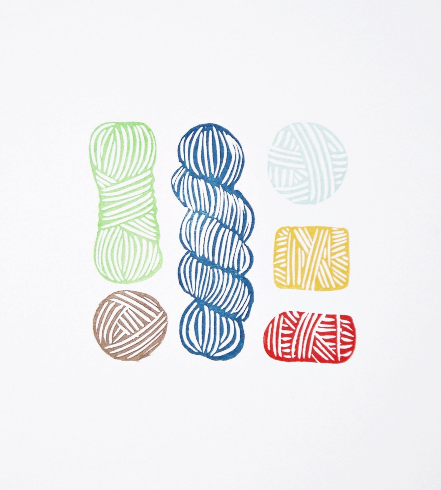

```{r, echo = FALSE, warning=FALSE}
library(tidyverse)
library(kableExtra)
library(reshape2)
library(flexdashboard)
library(shiny)
library(reticulate)
library(dplyr)
library(DT)

#source_python("recommender.py")
yarn <- read_csv("final_yarn.csv")
```

# Introduction

## Column

**Author**

Gwynnie Hayes

**Introduction**

Exploring a data set about yarn. This data set was created from reviews of yarn on the site [[Ravelry]{.underline}](https://www.ravelry.com/){.uri}. Ravelry is a website that has 1000's of patterns for all kinds of crafts that use yarn. Most commonly knitting and crocheting. The original dataset I used was published to TidyTuesday in 2022, [[Original Data]{.underline}](https://github.com/rfordatascience/tidytuesday/tree/main/data/2022/2022-10-11){.uri}.

**Model Goal**

I wanted to create a machine learning model that would give suggestions for specific yarns based on specifications from the user. Choosing a yarn for a project is a very subjective process. There are many things to consider when selecting yarn for a project:

-   Budget?

-   Gauge?

-   Is it a wearable?

-   Does it need structure?

-   Personal preference?

There are many articles online with guides and things to consider for your project but none of them give definitive suggestions. Another common way to get yarn suggestions is based on the pattern. More commonly in knitting patterns a specific yarn is called for. But for a broke college student like myself I don't have the money to buy the 200\$ worth of a specific yarn a project wants. So taking the features of yarn I wanted to create a model that would give definitive suggestions for the yarn to use based on the project and personal preferences of the crafter.

**Data Dictionary**

| variable | class | description |
|---------------|---------------|-------------------------------------------|
| discontinued | logical | Discontinued (TRUE/FALSE) |
| gauge_divisor | double | Gauge divisor – number of inches that equal min_gauge to max_gauge stitches |
| grams | double | Unit weight in grams |
| id | double | ID |
| max_gauge | double | Max gauge – max number of stitches that equal gauge_divisor |
| min_gauge | double | Min gauge – min number of stitches that equal gauge_divisor |
| name | character | Name |
| rating_average | double | Rating average – average rating out of 5 |
| rating_count | double | Rating count |
| rating_total | double | Rating total |
| texture | character | Texture – free text |
| thread_size | character | Thread size |
| wpi | double | Wraps per inch |
| yardage | double | Yardage |
| yarn_company_name | character | Yarn company name |
| yarn_weight_id | double | Yarn weight ID – identifier for the weight category |
| yarn_weight_name | character | Yarn weight name – name of the weight category |
| yarn_weight_ply | double | Yarn weight ply – ply for the weight category |
| yarn_weight_wpi | character | Yarn weight wraps per inch – WPI for the weight category |
| texture_clean | character | Texture clean – texture with light text cleaning |

**Yarn Vocabulary** Like many things yarn has its very own vocabulary. Some relevant terms in this case are:

-   Weight - this refers the how thick the yarn is
-   Ply - this refers how many strands of fiber are twisted together
-   Texture - this is similar to ply and in this data set the two are in the same columns but this refers to the feel of the yarn
-   Gauge Divisor - Is the number of stitches it takes to meet gauge
-   Gauge - is a measurement of stitches per in to make sure your project will be the correct size
-   WPI - wraps per inch, this is a way of measuring the weight of a yarn

**Data Cleaning**

[Clean Data](https://raw.githubusercontent.com/gwynniehayes/CS200B/refs/heads/main/final_yarn.csv){.uri}

I have used this data set in the past and it is a very overwhelming data set with many missing values. I started this project by trying to pair down this data set into a more manageable set. All the data cleaning I did was in R as I am much more familiar with R.

I started by filtering out yarns that were discontinued because if I wanted to give recommendations to the user I wanted them to be able to still buy the yarn. I then decided to join a data set with each of the fiber contents from the yarns which I quickly discovered had almost doubled the data because the fibers data set had a different row for each fiber type in a particular yarn. I decided to only take yarns that were 100% one fiber type, simply to just minimize the amount of data I was dealing with. I removed a few columns that contained only NA values or were not important to modeling or the type of craft I was interested in. I then looked at the reviews data and removed all NA values because it is not helpful to give a recommendation for something that is mostly a personal preference when there are no reviews, also in this I removed yarns that had less then 10 reviews to give the yarn a fighting chance at being accurately rated.

**Expanding in the Future**

I initially wanted to make a new feature of this data set that included the location of each of the yarn brands in hopes of mapping them. I think it would have been really interesting to see where a lot of yarn is getting produced, however in this data set there were over 10,000 different yarn brands and to get the location I would have had to individually search for each of them. Given the time frame this was not at all feasible. But is something I am really interested in still and might slowly work on in the future.

Another feature that would have been really interesting to have would be the price of each skein, this could also probably be created but would taken even longer given the 100,000 distinct yarns in this data set.

## Column

[{width="555"}](https://www.etsy.com/listing/173755223/yarn-skeins-block-print-art-original-5x7?show_sold_out_detail=1&ref=nla_listing_details)

# Exploring the Data

## Sidebar {.sidebar}

```{r}
inputPanel(
  selectInput("num_var", label = "Select a Numeric Variable to Explore",
              choices = c("Yardage" = "yardage", 
                          "Rating Average" = "rating_average",
                          "Rating Counts" = "rating_count",
                          "Ply" = "yarn_weight_ply",
                          "Grams" = "grams",
                          "Rating Total" = "rating_total",
                          "Gauge Divisor" = "gauge_divisor")))

plotTitle <- reactive({
  paste("Variable: ", input$num_var)
})
```

```{r}
inputPanel(
  selectInput("cat_var", label = "Select a Categorical Variable to Explore",
              choices = c("Yarn Weight" = "yarn_weight_name", 
                          "Yarn Texture" = "texture",
                          "Yarn Company" = "yarn_company_name",
                          "Fiber Type" = "fiber_type_name"))
)

plotTitle <- reactive({
  paste("Variable: ", input$cat_var)
})
```

## Column

```{r}
renderPlot({
  yarn |>
    ggplot(aes(x = .data[[input$num_var]])) +
    geom_histogram(fill = "lightblue", bins = 10) +
    labs(title = "Distributions of Numeric Variables", subtitle = plotTitle(), x = input$num_var, y = "Count") +
    theme_minimal()})
```

```{r}
renderPlot({
  yarn |>
  count(across(all_of(input$cat_var)), sort = TRUE) |>
  slice(1:12) |>
  ggplot(aes(y = n, x = .data[[input$cat_var]])) +
    geom_col(fill = "coral") +
    labs(title = "Categorical Variable Counts", subtitle = plotTitle(), x = input$cat_var, y = "Count") +
    theme_minimal() +
    theme(axis.text.x = element_text(angle = 45, vjust = 0.75))})
```

## Column

Numeric Variables:

| Variable       | Minimum | Median | Mean  | Maximum | NA's |
|----------------|---------|--------|-------|---------|------|
| Yardage        | 0.00    | 246.0  | 355.6 | 32839.0 | 0    |
| Rating Average | 1.00    | 4.69   | 4.54  | 5.00    | 0    |
| Rating Count   | 1.00    | 5.00   | 59.99 | 21517.0 | 0    |
| Rating Total   | 1.00    | 25.0   | 266.0 | 97630.0 | 0    |
| Ply            | 1.00    | 8.00   | 6.60  | 12.0    | 1604 |
| Grams          | 0.00    | 100.0  | 100.8 | 1814.0  | 567  |
| Gauge Divisor  | 1.00    | 4.00   | 3.63  | 4.00    | 6798 |

From this table we can see that all of the variables are very skewed, with Yardage, Rating Count, Rating Total, and Grams being right skewed and Rating Average is very left skewed. Gauge Divisor and Ply are both bimodal.

```{r}
fiber_weight <- table(yarn$fiber_type_name, yarn$yarn_weight_name)
#prop.table(fiber_weight, 1) * 100

fiber_weight_melt <- melt(prop.table(fiber_weight, 1) * 100)
ggplot(fiber_weight_melt, aes(Var2, Var1, fill=value)) +
  geom_tile() +
  geom_text(aes(label=sprintf("%.1f", value)), color="white") +
  scale_fill_gradient(low="lightblue", high="darkblue") +
  labs(title="Fiber Type (%) by Yarn Weight", x="Weight", y="Fiber Type") +
  theme(axis.text.x = element_text(angle = 45, vjust = 0.75)) +
  theme_replace()
```

# Modeling

**Supervised Model**

The goal of my model didn't seem to entirely fit what we have been learning in class so I decided to create a second model that was a supervised classification model.

*Model Goal:* I wanted to create a model that predicts the type of fiber a yarn is based on the attributes and rating of the yarn.

**Model Set Up**

*Split:* 80:20 Split with stratification.

*Missing Values:* This data contains a lot of missing values, which for ease of modeling made all of my numeric values the mean value and categorical values the most frequent value.

*Categorical Values:* This data set also has a lot of categorical variables, so I used one-hot encoding to make then numeric. For ease of modeling

There are 12 different weight yarns and 25 different fiber types in this data set alone, how ever there are many more possible weights and fiber types that exist in the world. In yarn manufacturing it is possible to make any fiber type into any weight yarn. So in making this model I had little hope for it preforming well because of the unlimited possibilities. 

**Initial Values**

| Model               | Accuracy | Precision | Recall | F1  | 
|---------------------|----------|-----------|--------|-----|
| Logistic Regression | 0.79     | 0.81      | 0.79   |0.74 |
| Decision Tree       | 0.76     | 0.75      | 0.76   |0.74 |
| KNN Classifier      | 0.73     | 0.73      | 0.73   |0.73 | 
| Random Forest       | 0.79     | 0.79      | 0.79   |0.76 |

From this we can see that of the types of models I ran one is not doing particularly better then the other. However I am surprised how well this model is actually doing given that it is a difficult thing to actually predict. 

# Yarn Recommender

## Sidebar {.sidebar}

```{r}
selectInput(
  "texture",
  "Texture (Plies)",
  choices = c(yarn$texture))

selectInput(
  "yarn_weight_name",
  "Weight Class",
  choices = c(yarn$yarn_weight_name))

selectInput(
  "fiber_type_name",
  "Fiber Type",
  choices = c(yarn$fiber_type_name))

actionButton("go", "Recommend Yarn 🧶")
```

### Recommended Yarn

```{r}
DTOutput("recommendation_table")

recommendations <- eventReactive(input$go, {
  user_input <- list()
  
  if (isTruthy(input$texture)) {
    user_input$texture <- input$texture}
  
  if (isTruthy(input$yarn_weight_name)) {
    user_input$yarn_weight_name <- input$yarn_weight_name}
  
  if (isTruthy(input$fiber_type_name)) {
    user_input$fiber_type_name <- input$fiber_type_name}
  
  recs <- recommend_from_preference(user_input)
  
  if (nrow(recs) == 0) {
    return(data.frame(Message = "No recommendations found!"))}
  
  return(recs)})

output$recommendation_table <- renderDT({
  req(recommendations())
  recommendations()
}, options = list(pageLength = 5, scrollX = TRUE))
```

I created a unsupervised learning model that would give the user recommendations for specific yarns based on their preferences that they can indicate. I then tried to incorporate it into this dashboard so that you could actually change the preferences but was having issues getting it to work. Instead I have the output of the functions I created in order to show the output of the model.

I am unable to publish this dashboard with python in the file but this is the function I created and it's output as an example.


## Yarn Recommender Examples {.tabset}

### Example 1

**Input Values:**

| Variable        | Value |
|-----------------|-------|
| Grams           | 50    |
| Yardage         | 300   |
| Yarn Weight WPI | 18    |
| Texture         | plied |

**Function: **
user_input = {  
'grams': 50,  
'yardage': 200,  
'yarn_weight_wpi': 10,  
'texture': "plied"  }
recommend_from_preference(user_input)

**Output: **

| yarn_company_name        | name                  | fiber_type_name| yarn_weight_name |
|--------------------------|-----------------------|----------------|----------------|
| Midara                   | Linas 260             | Linen          | Thread         |
| Namolio                  | Linen Thread          | Linen          | Thread         |
| LinenSpirit              | Lithuanian Linen 4ply | Linen          | Thread         |
| Cornelia Hamilton Yarns  | Sister Silk           | Silk           | DK             |
| Poyeng                   | SA                    | Acrylic        | DK             |
| Lantern Moon             | Indochine             | Silk           | DK             |
| Rendezvous               | Cashmere DK           | Cashmere       | DK             |
| Plant-Dyed Wool          | Cashmere dk           | Cashmere       | DK             |
| Sweet Fiber Yarns        | Cashmere DK           | Cashmere       | DK             |
| Feria                    | Maja                  | Acrylic        | DK             |


### Example 2

**Input:**

| Variable        | Value |
|-----------------|-------|
| Grams           | 100   |
| Yardage         | 50    |
| Yarn Weight WPI | 4     |
| Texture         | 1 ply |


**Function**

user_input = { 
  'grams': 100,  
  'yardage': 50,  
  'yarn_weight_wpi': 4,  
  'texture': "1 ply"}  
recommend_from_preference(user_input)

**Output**

| yarn_company_name           | name                                  | fiber_type_name | yarn_weight_name |
|-----------------------------|---------------------------------------|-----------------|------------------|
| Kreinik                     | Silk Serica                           | Silk            | Thread           |
| YarnArt                     | Macrame                               | Polyester       | DK               |
| Expression Fiber Arts       | Mulberry Silk DK                      | Silk            | DK               |
| Zauberwiese                 | silk mix                              | Silk            | DK               |
| Rieger Betten               | Alpaka Wolle                          | Alpaca          | DK               |
| Vermont Alpaca Company      | Natural DK                            | Alpaca          | DK               |
| Seehawer & Siebert          | Alpaca Fino                           | Alpaca          | DK               |
| DMC                         | Mouliné Color Variations              | Cotton          | Thread           |
| Lammy Yarns                 | Cablé 4                               | Acrylic         | DK               |
| Iris                        | Embroidery Floss Six Strands Brins    | Cotton          | Thread           |


### Example 3

**Input**

| Variable        | Value |
|-----------------|-------|
| Grams           | 1200  |
| Yardage         | 2450  |
| Yarn Weight WPI | 9     |
| Rating Average  | 1     |

**Function: **

user_input = {  
  'grams': 1200,  
  'yardage': 2450,   
  'yarn_weight_wpi': 9,  
  'rating_average': 1}   
recommend_from_preference(user_input)

**Output: **

| yarn_company_name        | name                         | fiber_type_name | yarn_weight_name |
|-------------------------|-------------------------------|-----------------|------------------|
| Loro Piana              | Malindi                       | Cotton          | DK               |
| Garn Specialisten       | Shetlandsuld                  | Wool            | Fingering        |
| Lankava Oy              | Suoravärjätty puuvillatrikoo  | Cotton          | Super Bulky      |
| Real Indigo Co, UK      | Denim DK                      | Cotton          | Worsted          |
| Lankava Oy              | Esteri-ontelokude             | Polyester       | Super Bulky      |
| Lankava Oy              | Lilli-ontelokude              | Cotton          | Super Bulky      |
| Hunters of Brora        | 100% New Wool                 | Wool            | Worsted          |
| Filati Biagioli Modesto | Aran                          | Cashmere        | Sport            |
| Lion Brand              | Cover Story                   | Polyester       | Super Bulky      |
| Caron                   | Anniversary Cakes             | Acrylic         | Super Bulky      |